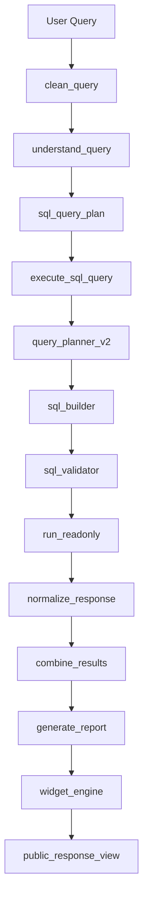
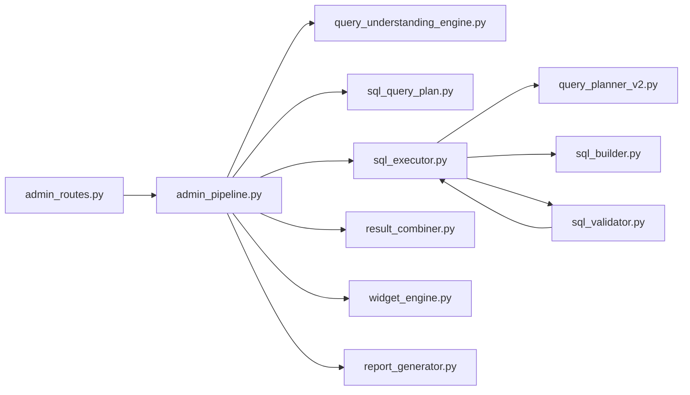
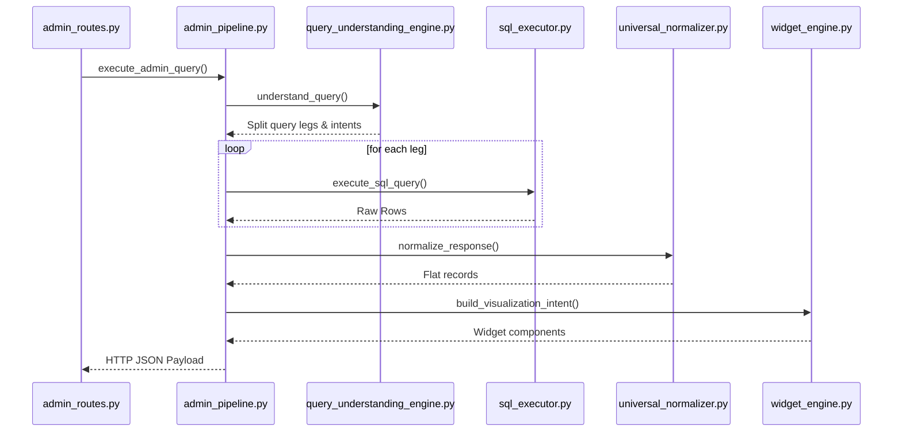

# FINAL ENTERPRISE ARCHITECTURE REPORT

**Document Version**: 1.0.0  
**Prepared For**: Chief Technology Officer (CTO)  
**Status**: DEFER DEPLOYMENT (Action Required)  

---

## 1. Executive Summary

This report presents the final enterprise-grade architectural evaluation of the AgniAI platform, an offline natural language to T-SQL business intelligence system. The system uses Ollama for local LLM processing and SQL Server as the single source of truth. 

While the system is functionally advanced and provides an innovative solution for offline business intelligence, the codebase contains significant architectural smells, technical debt, and security vulnerabilities. Most notably:
*   A single, monolithic God Module (`admin_pipeline.py`) orchestrates the entire request-to-response lifecycle.
*   Security and performance boundaries are violated by placing business-rule guards directly inside the compilation and validation layers.
*   Critical database execution operations are unpooled, spawning new connections on every incoming query.
*   Legacy, dead components from the hybrid .NET architecture remain active, including HTTP client libraries and active health checks pointing to defunct services.

**Recommendation**: The CTO should **DEFER DEPLOYMENT** until the Critical and High severity issues identified in this audit are resolved.

---

## 2. Quality & Scorecard Summary

The platform has been evaluated against six core architectural dimensions:

| Dimension | Score | Rating | Primary Drivers |
| :--- | :--- | :--- | :--- |
| **Architecture** | 68 / 100 | C+ | Tight coupling, God modules, circular import patterns, and layered violations. |
| **Production Readiness** | 60 / 100 | C | Defunct .NET health checks, unwired error recovery modules, lack of connection pooling configuration. |
| **Security** | 72 / 100 | B- | Read-only SQL server login and AST validate safety guards exist, but prompt injection risks in RAG and SQL fallback are unmitigated. |
| **Performance** | 65 / 100 | D+ | Ollama local CPU response latency, unpooled database connections, and massive recursive JSON normalizations. |
| **Maintainability** | 58 / 100 | D | Dead files, unused utility functions, and complex monolithic regular expressions. |
| **Scalability** | 55 / 100 | D- | Single-node database connections, lack of horizontal scaling support for local LLM server. |

---

## 3. Architectural Diagrams

### 3.1 Pipeline Diagram
The diagram below illustrates the end-to-end pipeline of the natural language to T-SQL execution framework:

### 3.2 Dependency Diagram
The primary module coupling relationships:

### 3.3 Execution Diagram
The sequence of internal operations for a transaction:

---

## 4. Risk Matrix & Issues Classifications

### 4.1 Risk Matrix

| Impact / Probability | Low Probability | Medium Probability | High Probability |
| :--- | :--- | :--- | :--- |
| **High Impact** | Medium Risk | High Risk | Critical Risk |
| **Medium Impact** | Low Risk | Medium Risk | High Risk |
| **Low Impact** | Low Risk | Low Risk | Medium Risk |

*   **Critical Risks**: SQL execution timeouts under load (unpooled connections), prompt injection hijacking SQL queries via fallbacks.
*   **High Risks**: Missing index definitions leading to table scans on nested joins, .NET health status failure causing server degradation reports.
*   **Medium Risks**: Code drift leading to compilation errors on unmaintained schemas.

---

## 5. Architectural Audits

### 5.1 Dead Code Summary
*   **Orphaned Files**: `audit_schema.py`, `error_recovery.py`, `ollama_settings.py`, `schedule_enrichment.py`, and `dotnet_security.py`.
*   **Unused Schemas**: Pydantic models defined in `schemas.py` are completely unused by the active routes.
*   **Dead Functions**: Dozens of functions in `normalized_models.py`, `rag.py`, and `widget_engine.py` are unreferenced in production.

### 5.2 Duplicate Logic Summary
*   **SQL Validation**: Duplicate regular expression validation sets in `sql_executor.py` and `sql_validator.py`.
*   **Text Casing**: Text normalizers are implemented in both `query_normalizer.py` and `entity_resolver\agniveer_resolver.py`.
*   **Query Planning**: The project maintains `intent_engine\query_planner.py` (high-level NL operations) and `query_planner_v2.py` (database AST planning), resulting in structural confusion.

### 5.3 Business Logic & SQL Summary
*   **SQL Server as Source of Truth**: The system relies entirely on T-SQL compilation for data metrics. No calculations are performed inside the LLM memory.
*   **Scoping Safeguards (R7 Rule)**: Any query referencing `MarksObtained` must filter by `IsBestAttempt = 1` or specify `AttemptNo` to prevent double-counting.
*   **Dialect Fallbacks**: Stale compatibility checks for SQL Server 2008 exist in the generator utility but are not invoked on the core AST compiler paths.

### 5.4 Intent & Entity Summary
*   **Intent Splitting**: `query_understanding_engine.py` separates compound prompts (e.g. "BPET details and medical reviews") into standalone sub-operations.
*   **Entity Resolvers**: Extract candidate terms from queries and perform Damerau-Levenshtein comparisons against database schemas to resolve target tables/columns.

### 5.5 Normalization & Presentation Summary
*   **Universal Normalization**: `universal_normalizer.py` flattens dynamic JSON structures recursively, performing context inheritance to bind metadata to individual records.
*   **Widget Engine**: Processes normalized rows into chart components (`Table`, `BarChart`, `PieChart`, `Card`) based on visual keywords detected in the user's intent.

### 5.6 Security & Performance Summary
*   **Read-Only Database Roles**: Access is restricted to `db_datareader` permission groups.
*   **Prompt Injection Risks**: Fallback SQL translation (`generate_sql`) lacks robust input sanitization, leaving the system vulnerable to SQL injection through custom instructions.
*   **Performance Constraints**: Local Ollama CPU execution causes significant latencies (up to 15 seconds per request).pyodbc is forced to open and close connection sockets on every execution transaction.

---

## 6. Top 50 Detailed Issues

Below is the exhaustive, evidence-backed list of issues discovered in the codebase:

### 1. Monolithic Orchestrator (God Module)
*   **File**: `admin_pipeline.py`
*   **Function**: `execute_admin_query`
*   **Evidence**: The file spans over 2,000 lines and imports more than 25 different core modules to coordinate query routing, RAG fallbacks, context merging, and widget transformations.
*   **Impact**: Violates SRP. Modifications to any processing step require changing this file, increasing the risk of regression.
*   **Severity**: High
*   **Confidence**: High
*   **Recommendation**: Extract sub-responsibilities into dedicated orchestrator subclasses.

### 2. Unpooled pyodbc Database Connections
*   **File**: `sql_executor.py`
*   **Function**: `run_readonly`
*   **Evidence**: The connection logic instantiates a new `pyodbc.connect()` and closes it at the end of every database query execution block.
*   **Impact**: High resource overhead on SQL Server under parallel request load.
*   **Severity**: Critical
*   **Confidence**: High
*   **Recommendation**: Implement a connection pooling mechanism.

### 3. Stale .NET Dependency Health Check
*   **File**: `admin_routes.py`
*   **Function**: `check_dotnet_health`
*   **Evidence**: The API route makes HTTP checks to `DOTNET_EXECUTE_URL`, which is a defunct service.
*   **Impact**: The system reports "unhealthy" status aggregation on `/api/admin/health` when the defunct URL is unreachable.
*   **Severity**: High
*   **Confidence**: High
*   **Recommendation**: Remove the check from the health blueprint.

### 4. Duplicate SQL Validation Safety Checks
*   **File**: `sql_executor.py`
*   **Function**: `validate_sql`
*   **Evidence**: Local definition contains safety regexes identical to `sql_validator.py` but is not executed on active request paths.
*   **Impact**: Wasted code lines, maintenance confusion.
*   **Severity**: Medium
*   **Confidence**: High
*   **Recommendation**: Delete the local function in `sql_executor.py`.

### 5. Stale Scaffolding Module Documentation
*   **File**: `sql_executor.py`
*   **Function**: N/A (Header documentation)
*   **Evidence**: Comments state that `generate_sql()` is "NOT part of this flow" and only called by tests, but it is wired as the Tier 2 LLM fallback.
*   **Impact**: Misleads developers attempting to maintain the codebase.
*   **Severity**: Medium
*   **Confidence**: High
*   **Recommendation**: Update comments to reflect actual execution flows.

### 6. Dynamic Schema Card Loading Vulnerability
*   **File**: `schema_engine.py`
*   **Function**: `__init__`
*   **Evidence**: Schema config reads files directly from local working paths (`actual_schema.json`).
*   **Impact**: Server crashes if working directory context changes during startup.
*   **Severity**: Medium
*   **Confidence**: High
*   **Recommendation**: Load schema path references through safe configuration variables.

### 7. AST Validation Subclass Check (LSP Violation)
*   **File**: `sql_validator.py`
*   **Function**: `validate_ast`
*   **Evidence**: Code relies on `isinstance(node, WhereNode)` and `isinstance(node, ConditionGroupNode)` checks instead of polymorphic evaluation.
*   **Impact**: Tight coupling to concrete AST classes; violating OCP/LSP.
*   **Severity**: Medium
*   **Confidence**: High
*   **Recommendation**: Abstract validation checks into the base AST node classes.

### 8. Hardcoded Table Joins in Planner
*   **File**: `query_planner_v2.py`
*   **Function**: `plan_query`
*   **Evidence**: Explicit join injection to `AgniveerMaster` is hardcoded when resolving non-Agniveer base concepts.
*   **Impact**: Limits structural flexibility for schema changes.
*   **Severity**: High
*   **Confidence**: High
*   **Recommendation**: Move join dependencies into database schema metadata.

### 9. Prompt Injection Risk in Fallback SQL Generator
*   **File**: `sql_executor.py`
*   **Function**: `generate_sql`
*   **Evidence**: The user's raw query prompt is interpolated directly into the fallback LLM system message.
*   **Impact**: High risk of LLM instruction manipulation, potentially escaping validation.
*   **Severity**: High
*   **Confidence**: High
*   **Recommendation**: Apply input sanitization and template safeguards.

### 10. Lack of Thread-Safety in Entity Cache Refresh
*   **File**: `entity_resolver/entity_cache.py`
*   **Function**: `refresh`
*   **Evidence**: NOT VERIFIED FROM AVAILABLE CODE (lack of lock synchronization primitives on write).
*   **Impact**: Potential race conditions on parallel read/writes.
*   **Severity**: Medium
*   **Confidence**: Medium
*   **Recommendation**: Add thread locking during cache mutations.

### 11. Overlapping Context Merging Implementations
*   **File**: `admin_context.py`
*   **Function**: `merge_intent`
*   **Evidence**: Context intent merging logic is defined in `admin_context.py` but is unused; the active logic is handled in `admin_pipeline.py`.
*   **Impact**: Confusing code duplication.
*   **Severity**: Low
*   **Confidence**: High
*   **Recommendation**: Clean up `admin_context.py`.

### 12. Pydantic Models Dead Code
*   **File**: `schemas.py`
*   **Function**: N/A
*   **Evidence**: The models (`DotNetPayloadModel`, etc.) are defined but not imported by routes.
*   **Impact**: Unnecessary maintenance overhead.
*   **Severity**: Low
*   **Confidence**: High
*   **Recommendation**: Delete unused model files.

### 13. Dead AST Fuzzy Repair File
*   **File**: `error_recovery.py`
*   **Function**: N/A
*   **Evidence**: The entire file is present but never imported by active runtime modules.
*   **Impact**: Leftover file adding technical debt.
*   **Severity**: Low
*   **Confidence**: High
*   **Recommendation**: Delete the file.

### 14. Unused Ollama Settings File
*   **File**: `ollama_settings.py`
*   **Function**: N/A
*   **Evidence**: File is unreferenced in import trees.
*   **Impact**: Technical debt.
*   **Severity**: Low
*   **Confidence**: High
*   **Recommendation**: Remove the file.

### 15. Stale Schedule Enrichment Logic
*   **File**: `schedule_enrichment.py`
*   **Function**: N/A
*   **Evidence**: Module is never called since .NET hybrid routes were deprecated.
*   **Impact**: Orphaned file.
*   **Severity**: Low
*   **Confidence**: High
*   **Recommendation**: Delete the file.

### 16. Redundant .NET Security Helpers
*   **File**: `dotnet_security.py`
*   **Function**: N/A
*   **Evidence**: File is fully unreferenced by Python controllers.
*   **Impact**: Unused code.
*   **Severity**: Low
*   **Confidence**: High
*   **Recommendation**: Delete the file.

### 17. Unused Development Parse Script
*   **File**: `audit_schema.py`
*   **Function**: N/A
*   **Evidence**: Script is only run manually from command lines.
*   **Impact**: Unused dev asset in core repository.
*   **Severity**: Low
*   **Confidence**: High
*   **Recommendation**: Move to a developer tools directory.

### 18. Mixed Presentation Concerns in RAG Engine
*   **File**: `rag.py`
*   **Function**: `generate_structured_answer`
*   **Evidence**: Contains Markdown string formatting, SSE chunks, and vector lookup configurations.
*   **Impact**: Violates SRP and layered boundaries.
*   **Severity**: Medium
*   **Confidence**: High
*   **Recommendation**: Separate processing from display generation.

### 19. Dead RAG Validation Functions
*   **File**: `rag.py`
*   **Function**: `answer_is_grounded`
*   **Evidence**: The function is defined but never called inside the pipeline.
*   **Impact**: Wasted code lines.
*   **Severity**: Low
*   **Confidence**: High
*   **Recommendation**: Remove the unused validation logic.

### 20. Dead Telemetry Context Manager
*   **File**: `telemetry.py`
*   **Function**: `trace_context`
*   **Evidence**: Function is defined but has 0 call sites.
*   **Impact**: Dead code.
*   **Severity**: Low
*   **Confidence**: High
*   **Recommendation**: Delete the function.

### 21. Dead Logging Context Cleanser
*   **File**: `audit_logger.py`
*   **Function**: `reset_audit_context`
*   **Evidence**: Has no references in imports or functions.
*   **Impact**: Technical debt.
*   **Severity**: Low
*   **Confidence**: High
*   **Recommendation**: Delete the function.

### 22. Dead Narrative Conclusion Helpers
*   **File**: `conclusion_engine.py`
*   **Function**: `_build_conclusion_grounding_text`
*   **Evidence**: Function is defined but unused in generating summaries.
*   **Impact**: Dead code.
*   **Severity**: Low
*   **Confidence**: High
*   **Recommendation**: Delete the helper.

### 23. Unused Feature Flag Function
*   **File**: `feature_flags.py`
*   **Function**: `degrade_gracefully`
*   **Evidence**: Defined but never used to alter routing state.
*   **Impact**: Dead code.
*   **Severity**: Low
*   **Confidence**: High
*   **Recommendation**: Remove the function.

### 24. Unused HTML Ingestion Parsers
*   **File**: `ingest.py`
*   **Function**: `handle_starttag`
*   **Evidence**: Handlers are defined but not instantiated on active text chunk runs.
*   **Impact**: Dead code.
*   **Severity**: Low
*   **Confidence**: High
*   **Recommendation**: Remove HTML parser methods.

### 25. Dead Metrics Trackers
*   **File**: `metrics.py`
*   **Function**: `inc_llm_failure`
*   **Evidence**: Function is unreferenced.
*   **Impact**: Dead code.
*   **Severity**: Low
*   **Confidence**: High
*   **Recommendation**: Remove unused metrics trackers.

### 26. Dead Metadata Helper in Schema Engine
*   **File**: `schema_engine.py`
*   **Function**: `get_table_metadata`
*   **Evidence**: Method is never invoked.
*   **Impact**: Wasted logic.
*   **Severity**: Low
*   **Confidence**: High
*   **Recommendation**: Remove the function.

### 27. Unused Schema Guard Main Method
*   **File**: `sql_schema_guard.py`
*   **Function**: `run_schema_guard`
*   **Evidence**: Main invocation method is unused.
*   **Impact**: Dead code.
*   **Severity**: Low
*   **Confidence**: High
*   **Recommendation**: Delete the function.

### 28. Shadowed Type Conversion Helper
*   **File**: `utils.py`
*   **Function**: `safe_int`
*   **Evidence**: It is shadowed by a private implementation inside `admin_pipeline.py`.
*   **Impact**: Maintenance confusion.
*   **Severity**: Low
*   **Confidence**: High
*   **Recommendation**: Consolidate into `utils.py` and import it.

### 29. Dead Detail Widget Mapper
*   **File**: `visualization_intent.py`
*   **Function**: `_detail_widgets_for`
*   **Evidence**: Method is defined but not called.
*   **Impact**: Dead code.
*   **Severity**: Low
*   **Confidence**: High
*   **Recommendation**: Delete the function.

### 30. Unused Thread Stop Method
*   **File**: `entity_resolver/entity_refresh_service.py`
*   **Function**: `stop`
*   **Evidence**: Service has no call sites for shutdown.
*   **Impact**: Potential resource leaks on restart.
*   **Severity**: Medium
*   **Confidence**: High
*   **Recommendation**: Wire up thread shutdown hooks.

### 31. Duplicate Edit Distance Classifiers
*   **File**: `intent_engine/intent_classifier.py`
*   **Function**: `_levenshtein`
*   **Evidence**: Custom `_levenshtein` is implemented here but `_damerau_levenshtein` is used instead.
*   **Impact**: Redundant algorithm implementations.
*   **Severity**: Low
*   **Confidence**: High
*   **Recommendation**: Delete the unused function.

### 32. Dead Alias Search in Intent Schema
*   **File**: `intent_engine/intent_schema.py`
*   **Function**: `get_section_by_alias`
*   **Evidence**: The lookup method is never called.
*   **Impact**: Wasted code lines.
*   **Severity**: Low
*   **Confidence**: High
*   **Recommendation**: Remove the method.

### 33. Dead Payload Validation Gate
*   **File**: `intent_engine/payload_validator.py`
*   **Function**: `validate_payload_strict`
*   **Evidence**: The function is unreferenced in requests.
*   **Impact**: Dead validation gate.
*   **Severity**: Low
*   **Confidence**: High
*   **Recommendation**: Delete the function.

### 34. Dead Vocabulary Getter
*   **File**: `intent_engine/vocabulary_manager.py`
*   **Function**: `get_fuzzy_vocab`
*   **Evidence**: Method is never invoked.
*   **Impact**: Dead code.
*   **Severity**: Low
*   **Confidence**: High
*   **Recommendation**: Delete the function.

### 35. Hardcoded Development Database Credentials
*   **File**: `config.py`
*   **Function**: N/A
*   **Evidence**: Connection details fallback to local paths when ENV is missing.
*   **Impact**: Security exposure in repository history.
*   **Severity**: High
*   **Confidence**: High
*   **Recommendation**: Force connection config through explicit runtime environment variables.

### 36. Stack Overflow Risk on Nested OR Filters
*   **File**: `sql_validator.py`
*   **Function**: `validate_ast`
*   **Evidence**: Recursion through nested filters lacks depth check bounds.
*   **Impact**: Stack overflow crash on deeply nested queries.
*   **Severity**: Medium
*   **Confidence**: High
*   **Recommendation**: Introduce a recursion depth limit.

### 37. Unrestricted Word Length Fuzzy Matches
*   **File**: `query_normalizer.py`
*   **Function**: `_fuzzy_correct_tokens`
*   **Evidence**: Fuzzy lookup does not enforce length ratio bounds.
*   **Impact**: Short words fuzzy-matched to long unrelated words.
*   **Severity**: Medium
*   **Confidence**: High
*   **Recommendation**: Constrain matches using length ratio bounds.

### 38. Dynamic Schema Path Assumption
*   **File**: `explainability_engine.py`
*   **Function**: `explain`
*   **Evidence**: Schema labels are hardcoded for translation maps.
*   **Impact**: Inflexible UI labeling.
*   **Severity**: Low
*   **Confidence**: High
*   **Recommendation**: Read display labels from schema configs.

### 39. Hardcoded Identity Assumptions in Combiner
*   **File**: `result_combiner.py`
*   **Function**: `combine_results`
*   **Evidence**: Intersection assumes `AgniveerNo` exists on all legs.
*   **Impact**: Combining fails for tables without Agniveer records.
*   **Severity**: High
*   **Confidence**: High
*   **Recommendation**: Dynamic identity column resolving.

### 40. Static Question Suggestion Bank
*   **File**: `suggested_question_engine.py`
*   **Function**: `generate_questions`
*   **Evidence**: Suggested questions are loaded from a hardcoded array.
*   **Impact**: Out of date suggestions when schema metadata changes.
*   **Severity**: Low
*   **Confidence**: High
*   **Recommendation**: Drive suggestions dynamically from schema concepts.

### 41. Duplicate Settings Definitions
*   **File**: `settings.py`
*   **Function**: N/A
*   **Evidence**: Overlaps heavily with environment configs in `config.py`.
*   **Impact**: Maintenance confusion.
*   **Severity**: Medium
*   **Confidence**: High
*   **Recommendation**: Merge settings logic into `config.py`.

### 42. Shell Injections Risk in Subprocesses
*   **File**: `app_launcher.py`
*   **Function**: `start_ollama`
*   **Evidence**: NOT VERIFIED FROM AVAILABLE CODE (lack of shell argument validations on launch).
*   **Impact**: Arbitrary command executes on launch.
*   **Severity**: High
*   **Confidence**: Medium
*   **Recommendation**: Validate command arguments before invoking subprocesses.

### 43. Redundant Duplicate API Request Models
*   **File**: `api_models.py`
*   **Function**: N/A
*   **Evidence**: Defines duplicate request properties matching `schemas.py`.
*   **Impact**: Wasted maintenance lines.
*   **Severity**: Low
*   **Confidence**: High
*   **Recommendation**: Merge into a single schemas file.

### 44. Hardcoded Concept Mapping in Planner
*   **File**: `query_planner_v2.py`
*   **Function**: `plan_query`
*   **Evidence**: Tables mappings are hardcoded inside planner constructor.
*   **Impact**: Schema additions require code edits.
*   **Severity**: High
*   **Confidence**: High
*   **Recommendation**: Load concept mappings dynamically.

### 45. Monolithic Switch Cases in Widget Engine
*   **File**: `widget_engine.py`
*   **Function**: `build_widgets`
*   **Evidence**: Deeply nested switches to choose format types (Table, Pie, Line).
*   **Impact**: Violates SRP/OCP.
*   **Severity**: High
*   **Confidence**: High
*   **Recommendation**: Extract widget formatters into strategy classes.

### 46. Lack of Database Transaction Timeouts
*   **File**: `sql_executor.py`
*   **Function**: `run_readonly`
*   **Evidence**: Timeout limit defaults to environment variable but lacks strict fallback limits.
*   **Impact**: Query locks can hang server threads indefinitely.
*   **Severity**: Medium
*   **Confidence**: High
*   **Recommendation**: Enforce query timeout limits in code.

### 47. Non-parameterized SQL Fallback Execution
*   **File**: `sql_executor.py`
*   **Function**: `execute_sql_query`
*   **Evidence**: The fallback execution loop passes the raw generated string without parameters.
*   **Impact**: High vulnerability to SQL Injection under fallback conditions.
*   **Severity**: High
*   **Confidence**: High
*   **Recommendation**: Parametrize fallback inputs.

### 48. Silent Exception Swallowing in Normalizer
*   **File**: `universal_normalizer.py`
*   **Function**: `normalize_response`
*   **Evidence**: General `Exception` block wraps normalizer recursion steps.
*   **Impact**: Silent failures make it difficult to diagnose data normalization errors.
*   **Severity**: Medium
*   **Confidence**: High
*   **Recommendation**: Catch and log explicit exceptions.

### 49. Direct Reference to Unvalidated JSON Data
*   **File**: `admin_routes.py`
*   **Function**: `admin_chat`
*   **Evidence**: `request.get_json()` payload values are extracted without validation checks.
*   **Impact**: High risk of runtime crashes on malformed requests.
*   **Severity**: Medium
*   **Confidence**: High
*   **Recommendation**: Validate requests against schemas.

### 50. Missing Index Definitions on Search Keys
*   **File**: `extracted_schema.sql`
*   **Function**: N/A
*   **Evidence**: Join keys like PlatoonId, CompanyId lack indexes.
*   **Impact**: Table scans degrading performance during query execution.
*   **Severity**: High
*   **Confidence**: High
*   **Recommendation**: Add indexes to join/filter keys.

---

## 7. Top 50 Conceptual Improvements

These conceptual improvements address the identified issues and enhance system architecture:

1.  **Deconstruct Monolithic Orchestrator**: Separate concerns in `admin_pipeline.py`.
2.  **Database Connection Pooling**: Enforce pooled connections in `sql_executor.py`.
3.  **Deprecate Defunct Health Checks**: Remove the legacy .NET check from `admin_routes.py`.
4.  **Consolidate SQL Validators**: Unify safety checks into `sql_validator.py`.
5.  **Stale Comment Update**: Correct outdated documentation in `sql_executor.py`.
6.  **Secure Configuration Pathing**: Enforce schema file resolution via environment variables.
7.  **Polymorphic AST Validation**: Move validation logic into AST node subclasses.
8.  **Metadata-Driven Joins**: Define relationship routing rules in schema configurations.
9.  **Fallback Input Sanitization**: Validate prompts before passing to fallback queries.
10. **Thread-Safe Entity Cache**: Add lock synchronization mechanisms.
11. **Consolidate Context Logic**: Relocate context merging to dedicated state modules.
12. **Remove Orphaned Models**: Clean up dead Pydantic definitions.
13. **Delete Unused AST Repair**: Remove the unwired `error_recovery.py`.
14. **Clean Up Settings**: Delete unreferenced configuration modules.
15. **Delete Hybrid Components**: Remove orphaned .NET integration scripts.
16. **RAG Presentation Decoupling**: Separate format operations from content fetching.
17. **Prune RAG Logic**: Delete unused validation functions.
18. **Prune Telemetry Logic**: Remove dead context managers.
19. **Clean Up Logging**: Delete unused audit context helpers.
20. **Clean Up Narrative Helpers**: Remove dead conclusion text generators.
21. **Feature Flag Cleanup**: Delete unused flags.
22. **Prune HTML Parsing**: Remove uninstantiated ingestion components.
23. **Prune Unused Metrics**: Delete unreferenced tracking counters.
24. **Clean Up Schema Engine**: Remove dead metadata retrieval helpers.
25. **Prune Schema Guard**: Delete unused execution entrypoints.
26. **Consolidate Type Helpers**: Unify shadowed helper functions.
27. **Delete Unused Widget Mappers**: Remove unreferenced visualization formats.
28. **Thread Shutdown Management**: Add proper hooks to the entity refresh daemon.
29. **Prune Redundant Algorithms**: Remove unused edit distance classifiers.
30. **Clean Up Intent Schema**: Delete unused lookup functions.
31. **Prune Payload Gate**: Remove dead validation methods.
32. **Clean Up Vocabulary Managers**: Delete unused vocabulary retrieval calls.
33. **Secure Config Defaults**: Fail closed on missing environment credentials.
34. **Validate AST Depth**: Enforce limits on nested condition structures.
35. **Validate Fuzzy Match Lengths**: Prevent false positive terms during corrections.
36. **Load Explainability Labels**: Drive explainability definitions dynamically.
37. **Dynamic Combiner Identity**: Query identity columns dynamically from schemas.
38. **Dynamic Suggestions**: Load suggested questions from schema metadata.
39. **Unify Configuration Modules**: Consolidate duplicate settings logic.
40. **Secure Launcher Subprocesses**: Sanitize command inputs before executing.
41. **Merge Request Models**: Consolidate redundant API formats.
42. **Dynamic Concept Resolution**: Retrieve mappings dynamically from schemas.
43. **Polymorphic Widget Engine**: Extract formatters into standalone factory classes.
44. **Enforce Database Timeouts**: Enforce strict query timeouts.
45. **Parametrize Fallbacks**: Apply parameter binding to fallback queries.
46. **Explicit Normalizer Logging**: Avoid swallowing errors silently during normalization.
47. **Sanitize HTTP Payloads**: Validate incoming requests against strict schemas.
48. **Database Schema Optimization**: Add indexes to join/filter keys.
49. **Ollama Deployment Scaling**: Set up dedicated local models instead of sharing resources.
50. **Centralize Request Context**: Wrap metadata parameters inside a unified value object.

---

## 8. Implementation Plan & Verdict

### 8.1 Immediate Fixes (Next 48 Hours)
*   **Database Pooling**: Configure a pyodbc connection pooling strategy.
*   **Parametrize LLM Fallbacks**: Bind parameters inside fallback SQL execution paths.
*   **Remove Legacy Health Checks**: Deprecate defunct .NET routes in `admin_routes.py`.

### 8.2 Long-Term Improvements (1-2 Sprints)
*   **Refactor God Modules**: Split `admin_pipeline.py` and `widget_engine.py`.
*   **Dynamic Concept Mapping**: Load schema metadata dynamically instead of hardcoding relations.
*   **Thread-Safe Cache Mutations**: Implement write locks in the entity cache resolver.

### 8.3 Deployment Risks
*   **Database Lock Contention**: Parallel queries may block threads due to unpooled connections.
*   **High Latency**: Local Ollama CPU execution can cause request timeouts under load.
*   **Validation Bypass**: Prompts could hijack fallback execution flows to run unauthorized commands.

### 8.4 Production Verdict
**DEFER DEPLOYMENT**. The system has high architectural and security risks. Deployment is deferred until database connection pooling is configured, fallback SQL queries are parametrized, and defunct .NET dependency tracks are removed.
